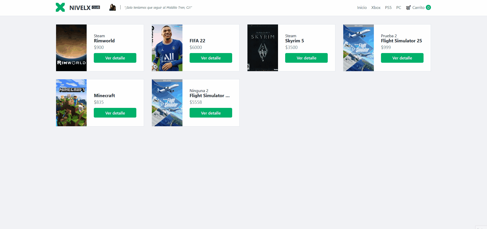

# react-js_ecommerce

Repositorio para subir los avances del curso de React JS de [Coderhouse](https://www.coderhouse.com/online/reactjs).

**Profesor:** Cristian Hourcade\
**Tutor:** Nicolás Díaz\
**Camada:** 17565

## Sobre el proyecto
- Ver en Vercel: [Vercel](https://react-js-ecommerce.vercel.app/)
- El ecommerce sería sobre venta de videojuegos físicos y digitales.
- Está bastante verde, nada más seleccionas los productos a comprar, y rellenas un formulario
- Esto genera una orden en Firebase con los datos de la compra, listado de items con sus cantidades y los datos del comprador.

## Cosas que tiene
- Carga y muestra un listados de productos desde una colección de Firebase.
- Podes seleccionar ya agregar "X" cantidad, dependiendo del stock, a tu carrito.
- El carrito se guarda en LocalStorage, para prevenir que se borre todo al actualizar la página
- Se hizo un service con alta, baja y modificación de colecciones de Firebase. `FirebaseService.js`
- Se hizo una colección de funciones útiles para manejar más a meno JavaScript vanilla. `FunctionUtils.js`

### Archivos de configuracion:
- En `cfg/Firebase/Firebase.js` está el código para inicializar Firebase.
- En `cfg/Firebase/FirebaseCollections.json` está el listado de colecciones, esto lo hice para no tener que estar repitiendo el nombre de la colección.
- En `cfg/Firebase/FirebaseConfig.json` están las key's de conexión a Firebase, esto debería estar incluido en el `.gitignore`.
- En `cfg/NavBar/NavBarItems.json` están los items-url de las categorías. Esto debería generarse dinámicamente trayendo una colección desde Firebase.

### Componentes:
- En `src/components/AddItem` está un componente de prueba, para realizar alta y modificación de productos, no debería haber estado en el entregable final.
- En `src/components/Order` está el componente donde va ser direccionado el usuario al terminar su compra.
- En `src/components/PopupConfirmMessage` está el componente que muestra un diálogo tipo modal, donde puede aceptar o rechazar, recibe por callback sus funciones.
- En `src/components/PopupNotification` componente donde se presenta el mensaje de las notificaciones popup.

### Containers:
- En `src/containers/CartContainer` está lógica para generar una orden de compra y actualizar el stock de los items.
- En `src/containers/ItemDetailContainer` está la lógica para mostrar el detalle de un item, carga por defecto su cantidad en el carrito.
- En `src/containers/ItemListContainer` carga el listado de productos que haya en Firebase, si recibe una categoría en la url, sólo va cargar los de esa categoría.


## Requisitos

**Dependencias:**\
`npm install firebase@8.0.2`

**Configuración de Firebase:**\
- Crear el archivo `FirebaseConfig.json` en `/src/cfg/Firebase`, pegando y completando lo siguiente:

```json
{
    "apiKey": "",
    "authDomain": "",
    "projectId": "",
    "storageBucket": "",
    "messagingSenderId": "",
    "appId": ""
}
```

## Pendiente a mejorar
Cosas pendientes o que me gustaría agregar/mejorar sobre el proyecto, pero por falta de tiempo no pude completar.

• **Notification popup**: `PopupNotification.jsx`
- [ ] Agregarle animaciones
- [ ] Hacer las notifacioens acumulativas
- - [ ] Tipo, si ya existe el popup en pantalla, agregar uno arriba.
- - [ ] Y al completar el timeout, borrarlo, no ocultar y mostrar.

• **Detalles de un producto**: `ItemDetail`
- [ ] Si se elimina desde el CartWidget, este no se entera con el contador
- [X] Al apretar "Añadir en el carrito" notificar con un pop-up.

• **Barra lateral con el carrito**: `CartWidget.jsx`
- [ ] Usar más React para su comportamiento en lugar de js vanilla.
- [ ] Realizarle una mejora en general, tanto diseño como lógica.

• **Carrito y formulario checkout**: `Cart.jsx`
- [ ] Agregar lógica para que pueda pagar con **MercadoPago**.
- [ ] Faltan las validaciones para los tipos de datos de email y telefono
- [ ] Estaría bueno también que las validaciones estén "en vivo"
- [ ] Al eliminar un producto:
- - [X] Preguntar si está seguro de eliminar, utilizando algún modal, no usar el confirm de js.

• **Orden completa**: `Order.jsx`
- [ ] Enviar un email con un comprobante de compra.
- [ ] Dar la opción de descargar un pdf con el comprobante de compra.

• **General**:
- [X] Mejorar el readme.
- [ ] Agregar íconos.
- [ ] Corregir el responsive.
- [ ] Hacer una mejora general.
- [ ] Mejorar las clases de CSS genericas o agregar Tailwinds que tiene un buen purge.
- [ ] Fijate de clavar en variables de env la configuración de Firebase.
- [ ] Tener un registro/inicio sesión de usuario, y un panel de administrador para agregar/modificar/bajar productos.

• **Carga del listado de productos desde Firebase**: `ItemList`
- [ ] Consultar una sóla vez todos los productos, o por categoría.
- [ ] Guardarlos en localStorage con su key de categoría.
- [ ] Una vez que se confirma la venta, realizar una consulta de stock (sólo de los que se hayan vendido) y volverlo a guardar en localStorage.
